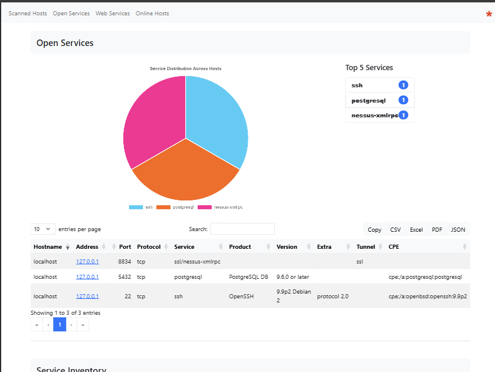

# NmapView
NmapView transforms raw Nmap XML scan results into clean and interactive HTML reports, making large-scale network scans easier to analyze. By using Bootstrap and DataTables, NmapView simplifies data navigation with sorting, filtering, exporting, and visually compelling layouts.

This software must not be used by military or secret service organisations.

## Features
- **Bootstrap Datatable**: Filters, search bars, and sorting for easy data manipulation
- **Export Functionality**: Export results as CSV, Excel, or PDF
- **Service Classification**: Automatically categorizes web services for better organization
- **HTTP/HTTPS Information**: Displays HTTP titles and SSL certificate details
- **Host Listing**: Detailed listing of scanned hosts and their properties
- **Service Indicators**: Shows whether services are encrypted (SSL/STARTTLS) or plaintext

## Example Report
Here's what the generated report looks like: [-> checkout a sample `report.html`](möbius.band/sample.html)

[](möbius.band/sample.html)

The HTML report generated by **NmapView** is organized into the following key sections:

### 1. **Scanned Hosts**  
This section provides a detailed summary of all scanned devices, including their status (`up` or `down`), MAC address, vendor info, detected operating system, IP address, hostname (if available), and the number of open TCP/UDP ports. It's perfect for quickly identifying active hosts and their basic attributes.

### 2. **Open Services**  
Displays details about all open services discovered during the scan. Key information includes the hostname, IP address, open port, protocol, service name, product version, tunnel type (if applicable), and CPE. The **Top 5 Services** is highlighted separately with a summary of the most common services (e.g., HTTP, SSH). This section helps pinpoint running services across your network.


### 3. **Service Inventory**  
Organizes services based on their name, listing associated ports, protocols, and hosts. This view clusters similar services (e.g., SSH, HTTP) and helps analyze the distribution of services across scanned devices. It's a high-level inventory to gauge what is actively running on your network.


### 4. **Web Services**  
Focuses on web-based services (HTTP, HTTPS, and others). This section provides details such as hostname, IP address, port, product/version, HTTP titles, SSL certificate information (if applicable), and direct links to the URLs. It's ideal for auditing web servers and ensuring compliance with encryption or versioning best practices.


### 5. **Online Hosts**  
A detailed accordion-style breakdown for each reachable device (`up` state). This section includes their open ports, protocols, service details, detected vulnerabilities, and custom scripts results (e.g., HTTP banners, SSL certificates). It’s a deep dive into per-host specifics for further investigation.


## Usage

1. Download the XSL stylesheet:
   ```bash
   wget https://raw.githubusercontent.com/dreizehnutters/nmap-bootstrap-xsl/main/nmap-bootstrap.xsl
   ```
2. Convert your Nmap XML file to HTML:
   ```bash
   xsltproc -o report.html nmap-bootstrap.xsl your_scan.xml
   ```


## Acknowledgments
- Inspired by the work of [honze-net](https://github.com/honze-net) and their [nmap-bootstrap-xsl](https://github.com/honze-net/nmap-bootstrap-xsl) project
- Fork of [Haxxnet/nmap-bootstrap-xsl](https://github.com/Haxxnet/nmap-bootstrap-xsl)